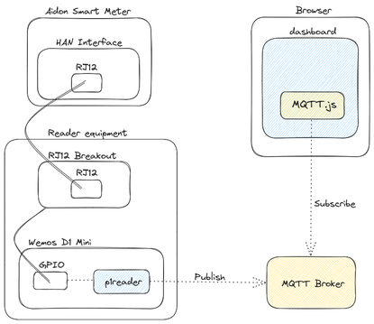
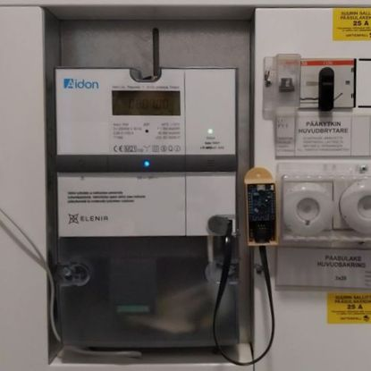

# Smart electricity meter dashboard

## Background

This is a hobby project to show meter readings from a smart electricity meter
with a home automation port.

The smart meter was installed in our house in April 2023 and the provided
documentation mentioned that the unit has a [HAN port][hanport] (also known
as a P1 port or an H1 port). The port would allow getting more detailed data
from the meter than was available through the grid company's apps.

I thought it would be interesting and fun to see how the electrical loads in
our house are balanced between phases and maybe learn something new in the
process when trying to figure out how to get the data out from the smart meter.

## Requirements

The solution must be able to show momentary values. Some time series data would
be nice to have but the time frame can be quite short; the grid company provides
a website where the historical data can be seen with good enough resolution.

The whole thing must run without a backend workload that needs to be managed self.
The solution used in the reader equipment is build on top of
[Home Assistant][home_assistant], but it requires a server to be running in the
same LAN where the reader equipment lives.

## System description

The following diagram shows the parts in the setup and how they are connected
together. The blue bits are software that was configured or built, the yellow
boxes are dependencies.

The reader is connected to the smart meter with an RJ12 cable. Inside the
reader, the serial traffic is read by the [p1reader][p1reader] software
(notice the branch). 

The reader software connects to the configured MQTT broker and publishes all
the values coming from the smart meter port.

The webapp runs in the browser and displays the values. It uses the
[MQTT.js][mqttjs] library to connect to the broker and subscribe to the topics.

## Reader equipment

Searching the Internet for a compatible HAN port reader finally provided this
absolute gold nugget of an article: [a blog text about Aidon HAN reader][blog]

This is what the reader looks like. The RJ12 breakout is attached to the bottom
of a 3D printed enclosure and the Wemos D1 Mini attaches to the breakout board.

This picture shows the reader attached to the smart meter's HAN port.

For more information about the reader equipment, see its [documentation][reader].

## Dashboard

The dashboard connects to the MQTT broker and subscribes to all the topics
under the topic prefix. Then it just shows the values it gets from the MQTT
broker. For more information about the dashboard, see its
[documentation][dashboard].

[hanport]: https://www.elenia.fi/tulevaisuuden-energia/sahkonkulutuksen-mittausuudistus/kotiautomaatioliitanta
[home_assistant]: https://www.home-assistant.io
[p1reader]: https://github.com/rainisto/esphome-p1reader/tree/Elenia_Aidon_v1.2_binary
[mqttjs]: https://github.com/mqttjs/MQTT.js
[blog]: https://omakotikotitalomme.blogspot.com/2022/10/elenian-aidon-rj12-kotiautomaatioliityn.html
[reader]: ./doc/reader_equipment.md
[dashboard]: ./dashboard/README.md
