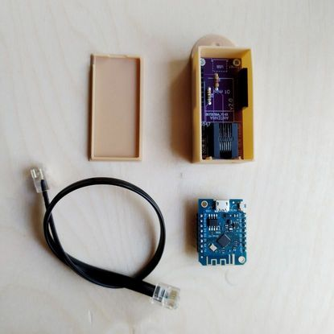

# Aidon HAN Port Reader

The HAN port reader can read the serial data that an Aidon 7534 smart
electricity meter outputs through its HAN port.

This document explains
* What HW and software is needed
* How to configure the software
* How to build the software

All the commands line examples are from Ubuntu.

## Hardware

Electrical diagrams and wiring are explained in the
[p1reader repository][p1reader]. For more information, see the related
[blog][blog] post.



## Software platform

The basis of the software is the [ESPHome][esphome] system. It is meant to work
with the [Home Assistant][home_assistant] home automation system out of the box.

This application will not use the Home Assistant system, just simply publish the
values it manages to read to an MQTT broker.

## Development environment

Install or configure the ESPHome tools that are needed to compile and deliver
the firmware into the Wemos D1 Mini. Follow Getting Started with the ESPHome
Command line on the [ESPHome][esphome] site.

I did not install anything, I just ran the commands using Docker. 

What I did have to do was to disable brltty (TTY for Braille devices) so that
the `/dev/ttyUSB0` was available for ESPHome. You might not have to do this
depending on your system configuration.

```bash
sudo systemctl stop brltty-udev.service
sudo systemctl mask brltty-udev.service
sudo systemctl stop brltty.service
sudo systemctl disable brltty.service
```

Also make sure your user has been added to the `dialout` group. You can check
that with the `groups` command, the output should contain `dialout`. 

## Configuration

Start by cloning the [p1reader repository][p1reader].

### Secrets

Then create a file `secrets.yaml` in the repository root and put your secrets in
there. The `p1reader.yaml` can reference the secrets in the `secrets.yaml` using
the `!secret` directive. Obviously come up with better passwords than these
examples:

```
wifi_ssid: "MyWifiSSID"
wifi_password: "tiger"
mqtt_broker_url: "broker.emqx.io"
mqtt_port: 1883
topic_prefix: "YourSpecialTopic"
```

Be sure to use a non-SSL port as `mqtt_port`. After much struggle I was not
able to get SSL working with MQTT in the ESPHome MQTT library. I think the
balance between security and the amount of more gray hair did not warrant
more efforts to get SSL working. Especially given that the data is probably
not useful for anybody listening in.

The `topic_prefix` will the topic prefix used in the [dashboard][dashboard].

### Reader configuration

Next, edit the `p1reader.yaml` configuration file and make sure these
sections are configured:

```yaml
...
substitutions:
  mqtt_topic: !secret topic_prefix
...
wifi:
  networks:
    - ssid: !secret wifi_ssid
      password: !secret wifi_password
...
mqtt:
  broker: !secret mqtt_broker_url
  port: !secret mqtt_port
  topic_prefix: ${mqtt_topic}
  discovery_retain: false
  birth_message:
    topic: ${mqtt_topic}/status
    payload: 1
    retain: true
  will_message:
    topic: ${mqtt_topic}/status
    payload: 0
    retain: true
  log_topic:
    topic: ${mqtt_topic}/diagnostic
    level: NONE
    retain: false
```

If you want to experiment and flash the firmware over the air, it could be
useful for the reader to have a fixed IP address. This can be achieved by
configuring your router's DHCP to assign a fixed IP to the reader's MAC
address. Or you can also configure it in the `p1reader.yaml`, actual IPs
in the configuration obviously depend on your network configuration:

```yaml
wifi:
  networks:
  - ssid: !secret wifi_ssid
    password: !secret wifi_password
    manual_ip:
      static_ip: 192.168.1.98
      gateway: 192.168.1.1
      subnet: 255.255.255.0
      dns1: 192.168.1.1
```

### Building and installing

Attach the Wemos D1 Mini to your computer with a USB cable.

Then, in the repository root, build and load the firmware:

```bash
docker run --rm --privileged -v "${PWD}":/config --device=/dev/ttyUSB0 -it ghcr.io/esphome/esphome run p1reader.yaml
```

Note that running the above command will create a directory called `.esphome` in
the working directory. The owner of the directory is going to be `root`.

### Viewing logs from a running device

To view logs from a running device, say:

```bash
docker run --rm --privileged -v "${PWD}":/config --device=/dev/ttyUSB0 -it ghcr.io/esphome/esphome logs p1reader.yaml
```

## Test the outcome

If everything went well, after connecting the thing to your smart meter you
should start receiving MQTT messages.

[p1reader]: https://github.com/rainisto/esphome-p1reader/tree/Elenia_Aidon_v1.2_binary
[esphome]: https://esphome.io
[home_assistant]: https://www.home-assistant.io
[dashboard]: ../dashboard/README.md
[blog]: https://omakotikotitalomme.blogspot.com/2022/10/elenian-aidon-rj12-kotiautomaatioliityn.html
